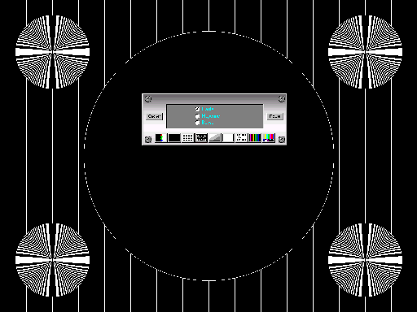



## Cathodic

### Description

Here is a project which allows to verify the adaptations of your screen. An aligment tools,

it is an old program originally writes in the 90s by S. Jenkins & Time/Slice Systems. I modified it to make it more practical. For the tray icon, it is from subscriber of whom I forgot coordinates, forgive me. The program can check for the Color purity/Scales, Resolution, Static Convergence, Readability, Dynamic Convergence, Color Bars, Aspect Ratio and White Balance.

Even though I can not take all the honors of this concept I made beautiful additions...Vote...It's important for me...
 
### More Info
 

             |
---                |---
**Submitted On**   |2002-06-21 21:35:36
**By**             |[Les Productions UnderDog](https://github.com/Planet-Source-Code/PSCIndex/blob/master/ByAuthor/les-productions-underdog.md)
**Level**          |Advanced
**User Rating**    |5.0 (15 globes from 3 users)
**Compatibility**  |VB 4\.0 \(32\-bit\), VB 5\.0, VB 6\.0
**Category**       |[Complete Applications](https://github.com/Planet-Source-Code/PSCIndex/blob/master/ByCategory/complete-applications__1-27.md)
**World**          |[Visual Basic](https://github.com/Planet-Source-Code/PSCIndex/blob/master/ByWorld/visual-basic.md)
**Archive File**   |[Cathodic978506232002\.zip](https://github.com/Planet-Source-Code/les-productions-underdog-cathodic__1-35920/archive/master.zip)

